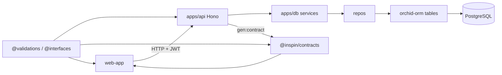

# 架构

请求从浏览器走到数据库，再按同一套类型走回来。

## 后端分层

- `apps/api/src/http/*`：路由、中间件、把 HTTP 转成 service 调用。不要在这里写 SQL。
- `apps/api/src/middleware`：`auth` / `authOptional` / `authAd`。
- `apps/db/src/tables`：表结构（运行时真相）。`snakeCase` + `baseColumns`（cuid、时间戳）。
- `apps/db/src/repos`：按表的查询封装。
- `apps/db/src/services`：用例（注册、会话、todo）。
- `apps/db/prisma/schema.prisma`：偏遗留 / Prisma Studio，**与 orchid 表可能不同步**。改业务表请改 `tables/`，不要只改 prisma。

## 契约生成

1. 在 `apps/api/src/http` 写 Hono 路由（校验用 `@inspin/validations`）。
2. `bun run gen:contract`：`parseHono` 扫源码 → 写出 `packages/@contracts/src/contract.ts`。
3. 前端用 `@packages/ts-rest-react-query` 按 contract 发请求。

手改 `contract.ts` 会在下次生成时被覆盖。

## 前端

- 路由：Wouter（`app-router.tsx`）。
- 请求：`config.baseURL` + token（Legend State / localStorage）。
- 列表与详情：`query-list` / `query-data` 包一层 react-query。
- 鉴权 UI：`components/guard`。

## 环境变量

| 包 | 文件 | 要点 |
| --- | --- | --- |
| api | `apps/api/.env` | `PORT`、`APP_STAGE`、`JWT_SECRET`、`DATABASE_URL` |
| db | `apps/db/.env` | `DATABASE_URL`、`DATABASE_LOG` |
| web | `apps/web-app/.env` | `VITE_API_URL_DEV`、`VITE_API_URL` |

`APP_STAGE=dev` 时 API 用 Bun 默认导出热重载；`prod` 会 `Bun.serve`。

## 已知取舍（克隆时注意）

- Zod 主版本在 api（v4）和 web/db（v3）不一致，改校验时要对齐导入。
- 部署脚本用 `sshpass`，密码来自环境变量，不适合当通用 CI 模板。
- `turbo.json` 的 build outputs 仍写着 `.next`，实际前端是 Vite；不影响本地 `pnpm dev`。
